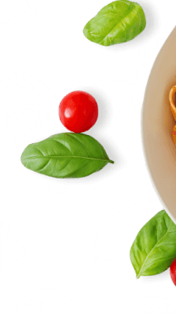
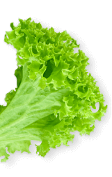
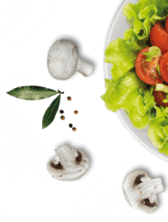

# IMPLEMENTATION PLAN — MR. FRÍAS FOOD TRUCK
**Fecha**: 2026-06-02
**Estado**: Pendiente de aprobación. No se ejecuta nada hasta recibir "APROBADO PARA IMPLEMENTAR."

---

## 1. Archivos que se tocarán

| Archivo | Tipo de cambio |
|---|---|
| `index.php` | Estructura HTML: secciones, columnas, clases, contenido |
| `assets/css/mrfrias.css` | CSS: eliminar reglas obsoletas, ajustar proporciones, agregar nuevas reglas mínimas |
| `partials/footer.php` | Agregar shapes decorativos del template |

**Total: 3 archivos.**

---

## 2. Archivos que NO se tocan

| Archivo | Razón |
|---|---|
| `assets/css/main.css` | CSS del template original — reutilizar sin modificar |
| `content/site.json` | Contenido aprobado — no se toca |
| `content/sucursales.json` | Contenido aprobado — no se toca |
| `content/menu.json` | Contenido aprobado — no se toca |
| `config.php` | Lógica de carga — no se toca |
| `build.mjs` | Build script — no se toca |
| `mailer.php` | Se deja como está (la sección que lo usa se elimina, él no) |
| `partials/head.php` | No se toca |
| `partials/header.php` | No se toca |
| `partials/preloader.php` | No se toca |
| `partials/sidebar.php` | No se toca |
| `partials/scroll-up.php` | No se toca |
| `assets/js/*` | JS del template — no se toca |
| `assets/img/*` | Assets — no se agregan ni eliminan archivos |
| `robots.txt`, `sitemap.xml`, `vercel.json` | No se tocan |
| `admin/*` | CMS — no se toca |

---

## 3. Cambios por sección — detalle

---

### SECCIÓN 1 — HERO

**Problema confirmado visualmente**: El título ocupa ~70% del peso visual en desktop. La foto de comida está oculta en mobile (`d-none d-lg-block`).

#### `index.php` — cambios

**L67** — Agregar segundo botón "Ver sucursales" después del botón actual, solo visible en desktop:
```
ANTES: 1 botón "Pedir por WhatsApp"
DESPUÉS: 2 botones
  - "Pedir por WhatsApp" [siempre visible]
  - "Ver sucursales" [d-none d-lg-inline-flex, estilo outline/ghost]
```

**L72** — Columna imagen: eliminar `d-none d-lg-block`, cambiar orden para mobile:
```
ANTES: col-12 col-lg-6 d-none d-lg-block
DESPUÉS: col-12 col-lg-6 order-1 order-lg-2
```
La columna de texto pasa a `order-2 order-lg-1` (imagen ARRIBA en mobile, texto ABAJO → comida visible inmediatamente en mobile).

#### `mrfrias.css` — cambios

**L498 + L504** — Reducir `min-height`:
```
ANTES: min-height: 770px
DESPUÉS: min-height: 580px
(ambas reglas — banner-wrapper y swiper-slide)
```

**L540–545** — Agregar `font-size` al título del hero:
```css
/* AGREGAR dentro de la regla .banner-style1 .section-title .title.mrfrias-banner-title */
font-size: clamp(2rem, 4vw, 3.25rem) !important;
/* El template nativo usa ~75px. Bajamos a máximo ~52px para dar espacio a la foto. */
```

**L989–1003** — Ajustar `.banner-thumb-area` altura en mobile:
```css
/* AGREGAR media query: */
@media (max-width: 991px) {
  .banner-thumb-area { height: 260px; }
  .mrfrias-banner-img { max-height: 240px; }
}
```

**Resultado esperado**:
- Desktop: imagen de comida visible a 50% del ancho, proporcionada
- Mobile: imagen de comida visible arriba, texto + 1 botón abajo
- Hero menos alto, comida protagonista

---

### SECCIÓN 2 — ANTOJOS

**Problema confirmado**: "Deditos" aparece en el render. No está filtrado por `destacado`.

#### `index.php` — cambio

**L113** — Cambiar el loop para filtrar solo `destacado: true`:
```
ANTES: foreach ($MENU as $item)
DESPUÉS: foreach (array_filter($MENU, fn($i) => $i['destacado']) as $item)
```

**L213–214** — En el marquee fantasma, eliminar "DEDITOS" de la lista:
```
ANTES: ...WRAPS · DEDITOS ·...
DESPUÉS: ...WRAPS ·... (sin deditos, doble bloque)
```

**`mrfrias.css`** — Sin cambios en esta sección.

**Resultado esperado**: 6 productos en el carrusel (Salchipapas, Hot dogs, Hamburguesas, Alitas, Quesadillas, Wraps). Deditos no aparece.

---

### SECCIÓN 3 — SUCURSALES ⚠️ Mayor cambio

**Problema confirmado visualmente**: El SVG custom no respeta la forma elegante del `chefe-card.style1` del template. Las cards parecen genéricas.

#### Principio de reconstrucción

Se elimina todo el HTML y CSS custom (v3/silueta/pin). Se vuelve al `.chefe-card.style1` del template (que ya existe y funciona en `main.css`). Solo se adapta el contenido interno.

La lógica del `chefe-card.style1` del template:
- `.chefe-thumb`: posición absoluta en `top: -180px`, tamaño 310×297px → **reemplazamos la foto del chef por un bloque circular rojo con ícono location-dot**
- Bloque blanco inferior con `border-radius: 100px 100px 0 0` → **viene del CSS del template, no lo tocamos**
- `.chefe-content`: nombre, especialidad, iconos → **adaptamos: nombre sucursal, zona+teléfono, botón WhatsApp**

#### `index.php` — cambios (L158–180)

**Estructura HTML nueva por card:**
```php
<div class="chefe-card style1">
  <!-- Reemplaza chefe-thumb: bloque rojo con ícono location -->
  <div class="chefe-thumb">
    <div class="mrfrias-location-thumb">
      <i class="fa-sharp fa-solid fa-location-dot"></i>
    </div>
  </div>
  <!-- Contenido en el bloque blanco -->
  <div class="chefe-content">
    <h3>[nombre sucursal]</h3>
    <p>[zona] · [telefono_visible]</p>
    <a class="theme-btn mrfrias-sucursal-wa-btn" href="[wa_link]" target="_blank" rel="noopener">
      Haz tu pedido aquí <i class="fa-sharp fa-regular fa-arrow-right"></i>
    </a>
  </div>
</div>
```

**Clases eliminadas del HTML**: `mrfrias-sucursal-card-v3`, `mrfrias-sucursal-silueta`, `mrfrias-sucursal-pin`, `mrfrias-sucursal-info`, `mrfrias-sucursal-zona-v2`, `mrfrias-sucursal-tel-v2`, `mrfrias-sucursal-name-v2`, `mrfrias-pedido-btn`

**Clases del template que se reutilizan**: `chefe-card style1`, `chefe-thumb`, `chefe-content`

#### `mrfrias.css` — cambios

**ELIMINAR** (bloques completos):
- L1186–1260: `.mrfrias-sucursal-info`, `.mrfrias-sucursal-zona-v2`, `.mrfrias-sucursal-tel-v2`, `.mrfrias-sucursal-name-v2`, `.mrfrias-pedido-btn`, `.mrfrias-pedido-btn:hover`
- L1331–1380: `.mrfrias-sucursal-card-v3`, `.mrfrias-sucursal-card-v3:hover`, `.mrfrias-sucursal-silueta`, `.mrfrias-sucursal-silueta svg`, `.mrfrias-sucursal-pin`
- L1381–fin del bloque LEGACY: `.mrfrias-historia-section.*`, `.mrfrias-historia-thumb.*`, `.mrfrias-historia-text` (marcados como LEGACY en el propio código)

**AGREGAR** — CSS nuevo mínimo para el bloque location:
```css
/* Reemplaza chefe-thumb en sucursales: bloque circular rojo con ícono */
.mrfrias-location-thumb {
  width: 180px;
  height: 180px;
  background: var(--mf-rojo);
  border-radius: 50%;
  display: flex;
  align-items: center;
  justify-content: center;
  font-size: 4.5rem;
  color: var(--mf-blanco);
  box-shadow: 0 15px 50px rgba(195, 19, 41, 0.4);
  margin: 0 auto;
}

/* Botón WhatsApp en sucursal — estilo definido */
.mrfrias-sucursal-wa-btn {
  background: var(--mf-rojo) !important;
  color: var(--mf-blanco) !important;
  margin-top: 1rem;
  width: 100%;
  text-align: center;
  justify-content: center;
}
```

**AJUSTAR** — override de la card del template para que el `chefe-thumb` pueda contener el bloque circular:
```css
/* El chefe-thumb original espera una imagen PNG, no un div.
   Overrideamos el tamaño para que el bloque circular quepa. */
.chefe-section .chefe-card.style1 .chefe-thumb {
  width: 180px;
  height: 180px;
  /* mantiene top: -180px y left: 50% translateX(-50%) del template */
}

/* Ajustar margin-top de la card para que el círculo quepa */
.chefe-section .chefe-card.style1 {
  margin-top: 120px; /* era 215px — reducir porque nuestro bloque es más pequeño que la foto original */
  padding-top: 80px; /* era 125px */
}
```

**Resultado esperado**: Cards con el `border-radius: 100px 100px 0 0` del template, bloque rojo circular flotando arriba con el ícono de ubicación, bloque blanco abajo con nombre, zona, teléfono y botón WhatsApp.

---

### SECCIÓN 4 — ACERCA DE NOSOTROS

**Problema confirmado**: La sección ya tiene `background: var(--mf-negro)` en CSS pero visualmente no tiene el peso editorial de la sección Testimonials del template. Faltan los shapes decorativos y hay un botón que no debe estar.

#### `index.php` — cambios (L192–217)

1. **Agregar shapes del template** antes del `<div class="container">`:
```html
<div class="shape"></div>
<div class="shape2"></div>
```

2. **Eliminar el botón** "PEDIR AHORA" (L203–205):
```
ELIMINAR:
<div class="btn-wrapper wow fadeInUp mt-4" data-wow-delay="0.9s">
  <a class="theme-btn" href="#sucursales">PEDIR AHORA ...</a>
</div>
```

3. El marquee rotante (`mrfrias-marquee-ghost`) se **mantiene** — es un elemento de branding visual.

#### `mrfrias.css` — cambios

**AGREGAR** — posicionamiento de los shapes (igual que `testimonial-wrapper.style1` del template):
```css
.mrfrias-acerca-section .shape {
  position: absolute;
  top: 0;
  left: 0;
  z-index: 1;
  pointer-events: none;
}
.mrfrias-acerca-section .shape2 {
  position: absolute;
  top: 228px;
  right: 0;
  z-index: 1;
  pointer-events: none;
}
```

El fondo `#1E1713` ya está correcto. El `z-index` del contenido del container se sube a `z-index: 2` para quedar por encima de los shapes.

**Resultado esperado**: Sección oscura con peso editorial, foto izquierda, texto derecho, shapes decorativos en esquinas, sin botón.

---

### SECCIÓN 5 — BLOQUE RESPIRO "Sabor que resuelve" (nueva)

**No existe actualmente en el rebuild.** Se inserta entre `#nosotros` (About) y `#galeria`.

#### `index.php` — inserción nueva

```php
<!-- ============================================================
     BLOQUE RESPIRO — "Sabor que resuelve"
     Referencia visual: offer-section del template Fresheat
============================================================ -->
<section class="mrfrias-respiro-section fix section-padding">
  <!-- Shapes del template -->
  <div class="offer-shape"></div>
  <div class="shape2"></div>
  <div class="shape3"></div>
  <div class="shape4"></div>
  <div class="container">
    <div class="row align-items-center g-5">
      <div class="col-xl-6 order-2 order-xl-1">
        <div class="respiro-content">
          <span class="sub-title wow fadeInUp" data-wow-delay="0.3s">
             Street food panameño
          </span>
          <h2 class="title wow fadeInUp" data-wow-delay="0.5s">Sabor que resuelve</h2>
          <p class="wow fadeInUp" data-wow-delay="0.7s">
            Hecho al momento, cargado de sabor, listo para resolver tu antojo donde estés.
          </p>
        </div>
      </div>
      <div class="col-xl-6 order-1 order-xl-2">
        <div class="respiro-thumb wow fadeInRight" data-wow-delay="0.4s">
          
        </div>
      </div>
    </div>
  </div>
</section>
```

#### `mrfrias.css` — CSS nuevo para esta sección:

```css
.mrfrias-respiro-section {
  background-image: url('../img/bg/offerBG1_1.jpg');
  background-size: cover;
  background-position: center;
  background-color: var(--mf-negro);
  position: relative;
  overflow: hidden;
}

.mrfrias-respiro-section .sub-title {
  color: var(--mf-naranja) !important;
  background: transparent !important;
  border: none !important;
  font-weight: 700;
  text-transform: uppercase;
  letter-spacing: 0.1em;
}

.mrfrias-respiro-section .title {
  color: var(--mf-blanco) !important;
  font-size: clamp(2.5rem, 5vw, 4rem) !important;
  font-weight: 900 !important;
  line-height: 1.1;
  margin-bottom: 1.5rem;
}

.mrfrias-respiro-section p {
  color: var(--mf-texto-secundario);
  font-size: 1.1rem;
  line-height: 1.65;
  max-width: 480px;
}

.mrfrias-respiro-img {
  max-width: 100%;
  filter: drop-shadow(0 30px 70px rgba(0, 0, 0, 0.7));
}
```

**Asset usado**: `assets/img/mrfrias/nuevas/tres x 1.png` — foto de platos no repetida en el hero (que usa hamburguesa/hotdog).

**Sin botón** — es un bloque de respiro visual puro.

---

### SECCIÓN 6 — GALERÍA "Mira lo que te espera"

**Sin cambios necesarios.** La sección ya está bien adaptada como slider de fotos de platos sin elementos de blog. Se mantiene tal cual.

---

### SECCIÓN 7 — HORARIO (eliminar como sección)

El contenido ya existe en el footer (columna "Horario"). La sección como bloque propio se elimina.

#### `index.php` — eliminar líneas 271–284:
```
ELIMINAR completamente:
<!-- 6. HORARIO -->
<section id="horario" class="section-padding mrfrias-horario-section">
  ...
</section>
```

#### `mrfrias.css` — eliminar reglas:
- L881–890: `.mrfrias-horario-section` y `.mrfrias-horario-line` (segundo bloque — L315–320 es el primero, también se elimina)

---

### SECCIÓN 8 — CTA FINAL

**Sin cambios.** La sección con `cta-hotdogs-neon.png` está bien y se mantiene. Posible revisión del copy pero no es bloqueante.

---

### SECCIÓN 9 — CONTACTO + FORMULARIO (eliminar)

La lógica de pedido es WhatsApp, no formulario. Emails y redes ya están en el footer.

#### `index.php` — eliminar líneas 313–413:
```
ELIMINAR completamente:
<!-- 8. CONTACTO -->
<section id="contacto" class="section-padding mrfrias-contacto-section bg-color2">
  ... (formulario completo + caja de información)
</section>
```

#### `mrfrias.css` — eliminar:
- L951: `.mrfrias-contacto-section { ... }` y su bloque completo

---

### SECCIÓN 10 — FOOTER

**Cambio mínimo.** El footer tiene buen contenido. Solo agregar los shapes decorativos del template.

#### `partials/footer.php` — agregar shapes dentro del `<footer>`:
```html
<!-- Shapes decorativos del template -->
<div class="footer-shape">
  
  
  
  
</div>
```

---

## 4. Clases del template que se reutilizan

| Clase (de `main.css`) | Sección | Por qué |
|---|---|---|
| `.chefe-card.style1` | Sucursales | Forma de card con curva superior, margin-top, padding — geometría del template |
| `.chefe-thumb` | Sucursales | Posición absoluta flotando sobre la card — geometría del template |
| `.chefe-content` | Sucursales | Bloque blanco inferior con nombre y contenido |
| `.offer-shape` | Bloque respiro | Shape decorativo inferior del template |
| `.banner-wrapper.style1` | Hero | Estructura y fondo del template — sin cambios |
| `.single-food-items` | Antojos | Estructura de card con foto flotante — sin cambios |
| `.testimonial-wrapper.style1` | About | Solo referencia de shapes (no se agrega la clase, solo sus shapes PNG) |
| `.gallery-wrapper.style1` | Galería | Ya en uso — no se toca |
| `.cta-wrapper.style1` | CTA Final | Ya en uso — no se toca |

---

## 5. Clases custom que se eliminan o reemplazan

| Clase (de `mrfrias.css`) | Sección | Acción |
|---|---|---|
| `.mrfrias-sucursal-card-v3` | Sucursales | ELIMINAR — reemplazada por `.chefe-card.style1` |
| `.mrfrias-sucursal-silueta` | Sucursales | ELIMINAR — reemplazada por `.mrfrias-location-thumb` |
| `.mrfrias-sucursal-pin` | Sucursales | ELIMINAR — el ícono va dentro de `.mrfrias-location-thumb` |
| `.mrfrias-sucursal-info` | Sucursales | ELIMINAR — contenido se mueve al `.chefe-content` |
| `.mrfrias-sucursal-zona-v2` | Sucursales | ELIMINAR |
| `.mrfrias-sucursal-tel-v2` | Sucursales | ELIMINAR |
| `.mrfrias-sucursal-name-v2` | Sucursales | ELIMINAR |
| `.mrfrias-pedido-btn` | Sucursales | ELIMINAR — reemplazada por `.mrfrias-sucursal-wa-btn` |
| `.mrfrias-horario-section` | Horario | ELIMINAR — sección eliminada |
| `.mrfrias-horario-line` (x2 instancias) | Horario | ELIMINAR |
| `.mrfrias-contacto-section` | Contacto | ELIMINAR — sección eliminada |
| `.mrfrias-historia-*` (bloque LEGACY) | Unused | ELIMINAR — ya marcado como LEGACY en el código |

---

## 6. CSS que se ajusta (sin eliminar)

| Regla actual | Cambio | Archivo / Línea |
|---|---|---|
| `min-height: 770px` (×2) | → `min-height: 580px` | `mrfrias.css` L498, L504 |
| `.mrfrias-banner-img` (sin font-size en el título) | Agregar `font-size: clamp(2rem, 4vw, 3.25rem) !important` a `.mrfrias-banner-title` | `mrfrias.css` L540 |
| `.banner-thumb-area` height fijo 520px | Agregar media query mobile: 260px en `max-width: 991px` | `mrfrias.css` L1001 |
| `.mrfrias-acerca-section` | Agregar `.shape` y `.shape2` posicionados | `mrfrias.css` + HTML |
| `.chefe-card.style1` margin-top y padding-top | → `margin-top: 120px`, `padding-top: 80px` para `.chefe-section` | `mrfrias.css` nuevo override |

---

## 7. Assets por sección

| Sección | Asset | Ruta | Estado |
|---|---|---|---|
| Hero — slide 1 | Hamburguesa exploded | `assets/img/mrfrias/nuevas/hero-burger-exploded.png` | ✅ |
| Hero — slide 2 | Hot dog lateral | `assets/img/mrfrias/nuevas/hotdog-side 1.png` | ✅ |
| Hero — slide 3 | Hamburguesa vertical | `assets/img/mrfrias/nuevas/hero-burger-vertical.png` | ✅ |
| Antojos × 6 | Fotos WhatsApp reales | `assets/img/mrfrias/whatsapp_image_*.800x725.jpeg` | ✅ |
| Sucursales — bloque superior | Ícono FA `fa-location-dot` | Font Awesome (ya cargado) | ✅ |
| About — foto izquierda | Mesa con amigos | `assets/img/mrfrias/nuevas/about-mesa-gente.jpg` | ✅ |
| About — shapes | `testimonialShape1_1.png`, `testimonialShape1_2.png` | `assets/img/shape/` | ✅ |
| Bloque respiro — foto | Tres platos | `assets/img/mrfrias/nuevas/tres x 1.png` | ✅ |
| Bloque respiro — fondo | Fondo oscuro template | `assets/img/bg/offerBG1_1.jpg` | ✅ |
| Bloque respiro — shapes | `offerShape1_1.png` a `_4.png` | `assets/img/shape/` | ✅ |
| CTA Final — foto | Hot dogs neon | `assets/img/mrfrias/nuevas/cta-hotdogs-neon.png` | ✅ |
| Footer — logo | Logo marca | `assets/img/mrfrias/logo.png` | ✅ |
| Footer — shapes | `footerShape1_1.png` a `_4.png` | `assets/img/shape/` | ✅ |

---

## 8. Mapa final de botones

| Ubicación | Texto | Destino | Visible en |
|---|---|---|---|
| Header sticky | "Pedir por WhatsApp" | `#sucursales` | Siempre |
| Hero — botón primario | "Pedir por WhatsApp" | `#sucursales` | Desktop + Mobile |
| Hero — botón secundario | "Ver sucursales" | `#sucursales` | Solo Desktop (`d-none d-lg-inline-flex`) |
| Sucursales — cada card | "Haz tu pedido aquí" | WhatsApp directo de esa sucursal | Siempre |
| CTA Final | Copy actual aprobado | `#sucursales` | Siempre |
| Botón flotante WhatsApp | Ícono WhatsApp | WhatsApp primera sucursal | Siempre |
| About | — | — | ❌ Eliminado |
| Antojos | "PÍDELO AHORA" (al pie de sección) | `#sucursales` | Siempre |
| Galería | Overlay WhatsApp en hover | `#sucursales` | Solo en hover — no es botón |
| Footer | Links de texto plano | WhatsApp por sucursal | Siempre — texto, no botones |

---

## 9. Secciones eliminadas o movidas

| Sección | Acción | Destino del contenido |
|---|---|---|
| `#horario` | ELIMINAR sección propia | Footer columna "Horario" — ya está |
| `#contacto` + formulario | ELIMINAR completo | Footer: emails y redes — ya están |
| Botón "PEDIR AHORA" en About | ELIMINAR | No se mueve a ningún lado |
| "Deditos" del render | FILTRAR en PHP loop | Permanece en `menu.json`, no se renderiza |

---

## 10. Riesgos visuales por sección

| Sección | Riesgo | Mitigación |
|---|---|---|
| Hero mobile | Medio — si la imagen apila mal en mobile puede empujar el texto fuera del viewport | Probar en 390px antes de aprobar. El `order-1 order-xl-1` puede ajustarse. |
| Sucursales | Alto — las cards `chefe-card.style1` requieren que el `.chefe-thumb` tenga la altura correcta para que la curva de la card se vea bien. Si el círculo rojo es muy pequeño o muy grande, la curva superior de la card blanca queda mal proporcionada. | Ajustar `margin-top` y `padding-top` de la card según el tamaño real del bloque rojo. Puede requerir un ajuste fino. |
| Bloque respiro | Bajo — `offerBG1_1.jpg` puede tener elementos del template que no encajen con el contenido de Mr. Frías | Si el fondo tiene elementos no deseados, reemplazar por `bg/bannerBG1_1.jpg` o un color sólido oscuro |
| About shapes | Bajo — los `testimonialShape` son PNG con transparencia. Si tienen colores del template (azul/verde), pueden chocar con la paleta de Mr. Frías | Revisar visualmente. Si chocan, omitir shapes y mantener solo el fondo oscuro + imagen |
| Footer shapes | Bajo — misma lógica que About shapes | Revisar colores de los PNGs |

---

## 11. Orden de implementación — 6 fases

### FASE 1 — Eliminaciones (menor riesgo, mayor impacto inmediato)
**Archivos**: `index.php`, `mrfrias.css`

1. Eliminar sección `#horario` completa (L271–284)
2. Eliminar sección `#contacto` completa (L313–413)
3. Filtrar Deditos del loop de Antojos (L113)
4. Eliminar "DEDITOS" del marquee (L213)
5. Eliminar botón "PEDIR AHORA" del About (L203–205)
6. Eliminar CSS: `.mrfrias-horario-section`, `.mrfrias-contacto-section`, bloque LEGACY `mrfrias-historia-*`

**Criterio de validación**: La página no muestra formulario. No muestra "Deditos". No muestra sección de horario separada. Footer ya tiene toda esa info.

---

### FASE 2 — Hero: proporciones y mobile
**Archivos**: `mrfrias.css`, `index.php`

1. Reducir `min-height` de 770px a 580px (×2)
2. Agregar `font-size: clamp(2rem, 4vw, 3.25rem)` al título del hero
3. Agregar media query mobile para `.banner-thumb-area`
4. Cambiar `d-none d-lg-block` por layout con order para mostrar imagen en mobile
5. Agregar segundo botón "Ver sucursales" solo en desktop

**Criterio de validación**: En desktop 1440px, la foto de comida es claramente visible al mismo peso visual que el texto. En mobile 390px, la imagen de comida aparece arriba del texto y no produce scroll excesivo. El título tiene tamaño proporcional.

---

### FASE 3 — Sucursales: reconstrucción de cards
**Archivos**: `index.php`, `mrfrias.css`

1. Reemplazar HTML de cada card (6 items)
2. Eliminar CSS custom (v3, silueta, pin, info, v2, legacy)
3. Agregar CSS nuevo: `.mrfrias-location-thumb`, `.mrfrias-sucursal-wa-btn`
4. Agregar overrides del template: `.chefe-section .chefe-card.style1` con margin-top y padding ajustados

**Criterio de validación**: Las 6 cards muestran el bloque circular rojo con ícono de ubicación flotando sobre la card blanca curva. El `border-radius: 100px 100px 0 0` es visible. El contenido (nombre, zona, teléfono, botón WhatsApp) está bien distribuido. No hay cajas genéricas.

---

### FASE 4 — About: shapes y eliminación de botón
**Archivos**: `index.php`, `mrfrias.css`

1. Agregar shapes `testimonialShape1_1.png` y `testimonialShape1_2.png` al HTML
2. Agregar CSS de posicionamiento para los shapes
3. Confirmar que el fondo oscuro `#1E1713` funciona visualmente con los shapes

**Criterio de validación**: La sección tiene peso editorial visual. Los shapes decorativos están en las esquinas. El botón "PEDIR AHORA" no aparece. El marquee rotante se mantiene.

---

### FASE 5 — Bloque respiro "Sabor que resuelve"
**Archivos**: `index.php`, `mrfrias.css`

1. Insertar la nueva sección entre About y Galería
2. Agregar CSS de la sección

**Criterio de validación**: La sección aparece con fondo oscuro, foto de `tres x 1.png` visible, título "Sabor que resuelve" en blanco, sin botón. Actúa como pausa visual entre About y Galería.

---

### FASE 6 — Footer: shapes decorativos
**Archivos**: `partials/footer.php`

1. Agregar los 4 `footerShape` PNG al footer

**Criterio de validación**: El footer tiene shapes decorativos visibles. El contenido existente (logo, sucursales, horarios, emails) no se altera.

---

## 12. Criterios de validación final (post todas las fases)

| Criterio | Cómo verificar |
|---|---|
| La comida domina en el hero | Screenshot rebuild-desktop.png nueva: foto ocupa ~50% del ancho |
| Hero mobile tiene comida visible | Screenshot rebuild-mobile.png nueva: imagen visible arriba del texto |
| No hay formulario de contacto | Buscar visualmente en el rebuild: ninguna caja de input/textarea |
| No hay sección de horario separada | Scroll visual: el horario solo aparece en el footer |
| Sucursales se ven como chefe-cards | Las 6 cards tienen el bloque circular rojo flotando sobre la curva blanca |
| Deditos no aparece | Solo 6 productos visibles en Antojos |
| About es editorial/oscuro | Fondo `#1E1713` con shapes, sin botón |
| "Sabor que resuelve" existe | Bloque visible entre About y Galería |
| Máximo 2 botones en hero desktop | Contar botones visibles en el hero a 1440px |
| Máximo 1 botón en hero mobile | Contar botones visibles en el hero a 390px |
| Botón flotante WhatsApp no tapa contenido | Verificar en mobile que no solapa CTAs críticos |

---

## Resumen ejecutivo del plan

**3 archivos tocados** (`index.php`, `mrfrias.css`, `partials/footer.php`).

**No se tocan**: `main.css`, todos los JSONs, todos los assets, JS, build.mjs.

**6 fases** de menor a mayor riesgo. Cada fase tiene criterio de validación visual propio antes de continuar.

**Mayor cambio**: Sucursales (Fase 3) — reconstrucción completa de cards volviendo al `.chefe-card.style1` del template. Riesgo alto pero aislado.

**Menor cambio**: Antojos (1 línea PHP) y Footer (agregar shapes).

---

No ejecutaré cambios hasta recibir la frase: **APROBADO PARA IMPLEMENTAR.**
